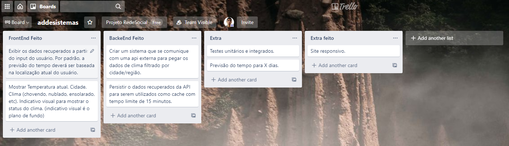

# Aplicativo de previsão do tempo em Angular e Flask

# Front-End

Para executar front-end rode: npm start

# Back-End

Para rodar use o comando .\env\Scripts\Activate.ps1 para ativar o ambiente virtual python
em seguida rode: python flaskapi.py para executar a API feita em Flask. Para executar a API feita em FASTAPI rode: uvicorn main:app --reload (obs: a parte de cache foi feita epenas para flask)

